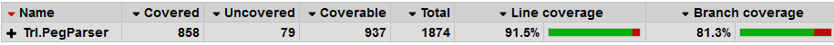

# Overview

** NB: THIS IS PRE-RELEASE SOFTWARE **

_Trs.PegParser_ contains a tokenizer and a parser. The tokenizer uses regular expressions to define tokens, and exposes both matched and unmatched character ranges. The PEG Parser (under construction) will use parsing expression grammers with tokens produced by the tokenizer.

# Installation via Nuget

See [https://www.nuget.org/packages/Trs.PegParser/](https://www.nuget.org/packages/Trs.PegParser/) for nuget package.

# Unit Test Code Coverage

Unit tests can be run using the `.\test.ps1` script. This will generate a code coverage report in the `.\UnitTestCoverageReport` folder using [Coverlet](https://github.com/tonerdo/coverlethttps://github.com/tonerdo/coverlet) and [ReportGenerator](https://github.com/danielpalme/ReportGenerator).

# Licence

Trs.PegParser is released under the MIT open source licence. See LICENCE.txt in this repository for the full text.
